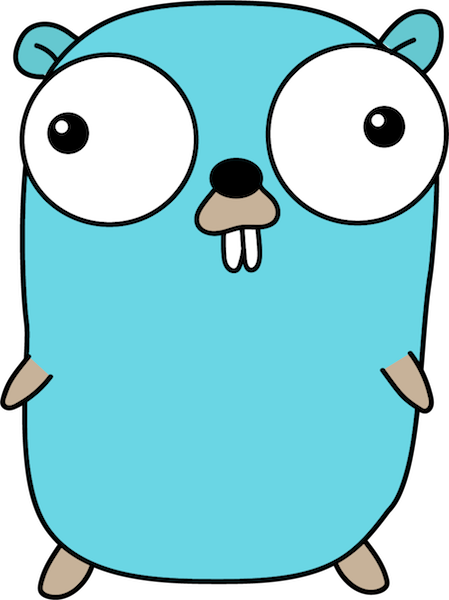

# BBC Gophers — Go Language Workshop Repository



```
func main() {
	fmt.Println("Hello, BBC Gophers!")
}
```

We are on Slack as #eng-golang

We use this book for study:
[The Go Programming Language by Alan Donovan and Brian W. Kernighan](https://www.gopl.io/)

If you don't have a Go environment set up, follow the
[Getting Started](https://golang.org/doc/install) instructions to do so.

Each week we will complete one chapter. To take part, create your own directory
in the [workspaces](workspaces) directory with whatever name you chose. Change
directory to your workspace Then un-tar the examples there.

e.g.

```
cd workspace
mkdir bobbyfoo
cd bobbyfoo
tar xzvf ../../exercises.tar.gz
```

Add any source code and stuff in the exercise directory. Commit directly to
master. Just don't break things...well, fix things if they do break! :)

## Links

[A Tour of Go](https://tour.golang.org/welcome/1)

[How to Write Go Code](https://golang.org/doc/code.html)

[Effective Go](https://golang.org/doc/effective_go.html)

[Source code: The Go Programming Language](https://github.com/adonovan/gopl.io)
